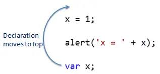
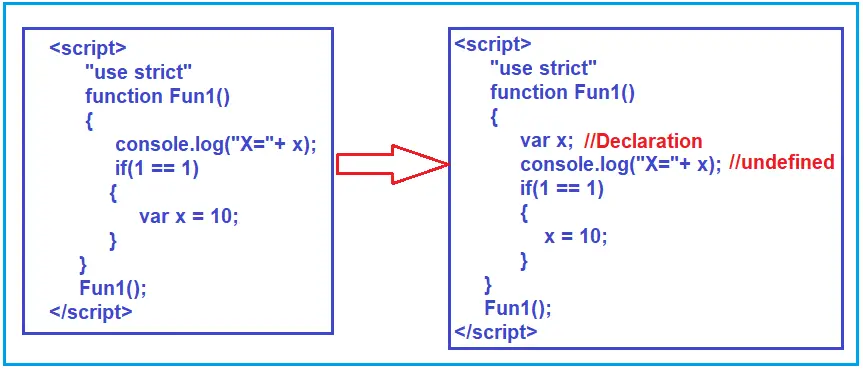

# JavaScript Questions

### 1.What is JavaScript?

JavaScript is a lightweight, cross-platform, single-threaded, and interpreted compiled programming language. It is also known as the scripting language for web pages. It is well-known for the development of web pages, and many non-browser environments also use it.

JavaScript is a weakly typed language (dynamically typed). JavaScript can be used for Client-side developments as well as Server-side developments. JavaScript is both an imperative and declarative type of language. JavaScript contains a standard library of objects, like Array, Date, and Math, and a core set of language elements like operators, control structures, and statements. 

### 2. What are the different data types present in javascript?

 To know the type of a JavaScript variable, we can use the typeof operator.

#### 1. Primitive types

- 1. <b>String</b> -  It represents a series of characters and is written with quotes. A string can be represented using a single or a double quote.

- 2. <b>Number</b> - It represents a number and can be written with or without decimals.

- 3. <b>Bigint</b> - This data type is used to store numbers which are above the limitation of the Number data type. It can store large integers and is represented by adding “n” to an integer literal.

- 4. <b>Boolean</b> - It represents a logical entity and can have only two values : true or false. Booleans are generally used for conditional testing.

- 5. <b>Undefined</b> - When a variable is declared but not assigned, it has the value of undefined and it’s type is also undefined.

- 6. <b>Null</b> - It represents a non-existent or a invalid value.

- 7. <b>Symbol</b> - It is a new data type introduced in the ES6 version of javascript. It is used to store an anonymous and unique value.

  #### 2. Non-primitive types

- Primitive data types can store only a single value. To store multiple and complex values, non-primitive data types are used.
- 1. <b>Object</b> - Used to store collection of data.

### 3. Explain Hoisting in javascript.

- Hoisting is the default behaviour of javascript where all the variable and function declarations are moved on top.

This means that irrespective of where the variables and functions are declared, they are moved on top of the scope. The scope can be both local and global.

