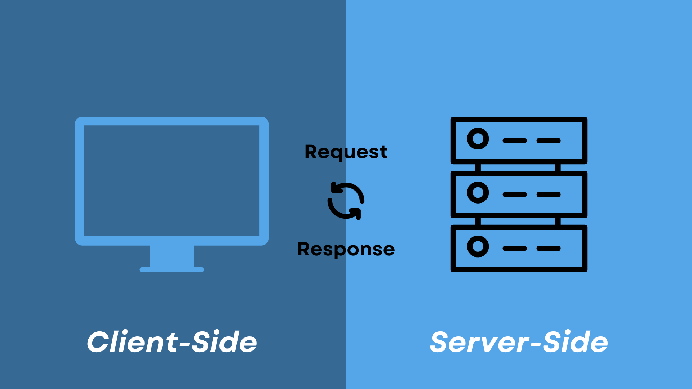

<!-- $${\color{red}Welcome \space \color{lightblue}To \space \color{lightgreen}{github}}$$ -->

# JavaScript Questions

### 1. What is JavaScript what is the role of JavaScript engine? ${\color{none} \space \color{yellow}{V.IMP.}}$

JavaScript is a lightweight, cross-platform, single-threaded, and interpreted compiled programming language. It is also known as the scripting language for web pages. It is well-known for the development of web pages, and many non-browser environments also use it.  That is used for converting static web pages to interactive and dynamic web pages.

#### ${\color{none}{} \space \color{yellow}{JavaScript-Engines}}$

<!-- JavaScript is a weakly typed language (dynamically typed). JavaScript can be used for Client-side developments as well as Server-side developments. JavaScript is both an imperative and declarative type of language. JavaScript contains a standard library of objects, like Array, Date, and Math, and a core set of language elements like operators, control structures, and statements.  -->

### 2. What are the different data types present in javascript?

 To know the type of a JavaScript variable, we can use the typeof operator.

#### 1. Primitive types

- 1. <b>String</b> -  It represents a series of characters and is written with quotes. A string can be represented using a single or a double quote.

- 2. <b>Number</b> - It represents a number and can be written with or without decimals.

- 3. <b>Bigint</b> - This data type is used to store numbers which are above the limitation of the Number data type. It can store large integers and is represented by adding “n” to an integer literal.

- 4. <b>Boolean</b> - It represents a logical entity and can have only two values : true or false. Booleans are generally used for conditional testing.

- 5. <b>Undefined</b> - When a variable is declared but not assigned, it has the value of undefined and it’s type is also undefined.

- 6. <b>Null</b> - It represents a non-existent or a invalid value.

- 7. <b>Symbol</b> - It is a new data type introduced in the ES6 version of javascript. It is used to store an anonymous and unique value.

  #### 2. Non-primitive types

- Primitive data types can store only a single value. To store multiple and complex values, non-primitive data types are used.
- 1. <b>Object</b> - Used to store collection of data.

### 3. Explain Hoisting in javascript.

- Hoisting is the default behaviour of javascript where all the variable and function declarations are moved on top.

This means that irrespective of where the variables and functions are declared, they are moved on top of the scope. The scope can be both local and global.

#### Example 1:

#### Example 2:

### 4. Why do we use the word “debugger” in javascript?

The debugger for the browser must be activated in order to debug the code. Built-in debuggers may be switched on and off, requiring the user to report faults. The remaining section of the code should stop execution before moving on to the next line while debugging.

### 5. Difference between “ == “ and “ === “ operators.

Both are comparison operators. The difference between both the operators is that “==” is used to compare values whereas, “ === “ is used to compare both values and types.

### 6. Difference between var and let keyword in javascript.

### 7. what are client-side and server-side?  ${\color{none} \space \color{yellow}{V.IMP.}}$

- Client-side means that the action takes place on the user’s (the client’s) computer. Server-side means that the action takes place on a web server. 
#### client side
- A client is a device, application, or software component that requests, and Consumer services or resources from a server.

#### Server side

- A server is a device, computer, or software application that provides services resources, or functions to clients.

#### Client-side programming languages
- People in careers like web design and user experience design focus on client-side development. Client-side developers use specific programming languages, including:
- 1. <b>HTML</b>: HTML, which stands for hypertext markup language, is the standard language for web development. HTML builds a website's structure and renders a website in a browser.
- 2. <b>CSS</b>: CSS, which stands for Cascading Style Sheets, is a design language that developers use to add visual design elements to a website coded in HTML. Developers can use CSS to make their websites look more visually appealing on users' devices.
- 3. <b>JavaScript</b>: JavaScript is a scripting language that developers can use for web development, web applications and other purposes. Developers can use JavaScript to make websites dynamic and interactive.
- 4. <b>VBScript</b>: VBScript is a client-side scripting language that certain browsers support. Developers can use VBScript to add interactive elements to websites.

#### Server-side programming languages
Software developers, database administrators and web developers typically use server-side development. Server-side developers can use many programming languages, including:

- 1. <b>Java</b>: Java is an object-oriented programming language that developers can use for a variety of purposes, including software and application development.
- 2. <b>Python</b>: Python is an object-oriented, general-purpose programming language that developers can use for web development, application development, operating systems and other purposes. Python has applications in data science, finance, computing and other fields.
- 3. <b>SQL</b>: SQL, which stands for Structured Query Language, is the industry-standard language for interacting with databases. Developers can use SQL to manipulate data in databases, including updating, retrieving and deleting data.
- 4. <b>PHP</b>: PHP, which stands for Hypertext Preprocessor, is a scripting language developers use to create websites and web applications. PHP can connect to databases to display content on websites.

### What is Scope in JavaScript? ${\color{none} \space \color{yellow}{V.IMP.}}$

